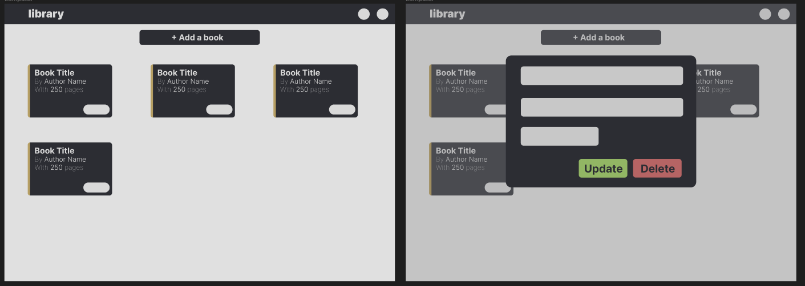
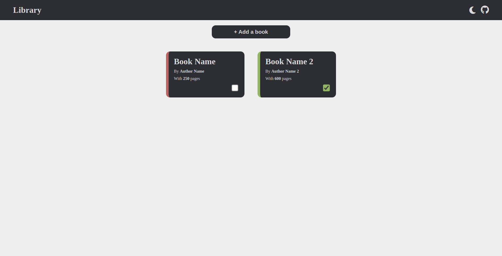
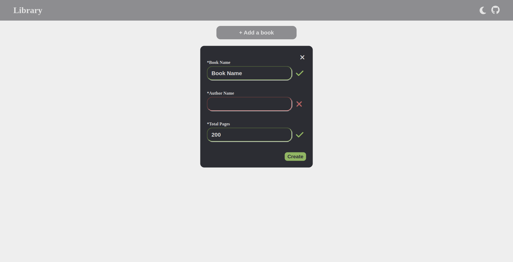

# Library

Library created with html, css and js.

## About the App

The project is from [The Odin Project](https://www.theodinproject.com/lessons/node-path-javascript-library) curriculum.

### Features

- It's a library which allows save, update and remove books
- Each book has a title, an author and a number of pages
- Also, it allows changing the state of the book between "read" and "no read"
- It has a changeable light/black theme
- It's support responsive design

### Tools and technology

- Visual Studio Code
- Linux Terminal
- Font Awesome Icons
- Figma
- Git and GitHub
- HTML and CSS
- JavaScript

### Learnings

- Basic "change theme" functionality
- Animations to change the state of the book
- Basic use of objects in JavaScript (**Update**: Refactor code using class and factories)

## Screenshots

### Design in Figma

### Final App

## Author

[Sergio García](https://github.com/sergiogarciiam)

## License

This project is open source and available under the [MIT License](./LICENSE).
